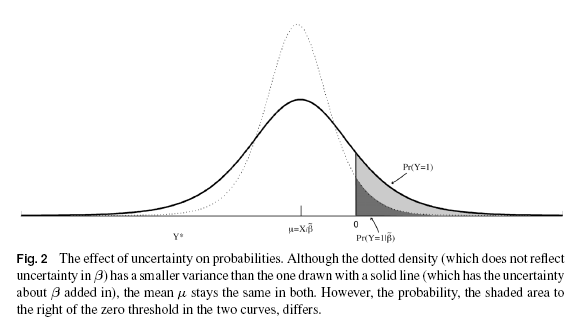

```{r setup, include=FALSE}
library(tidyverse)
library(knitr)
```

## Big Ideas

- **Selection on Y**: In rare-event data, we don't need to collect every non-event observation. 
    - Adjust loss function
    
- **Parameter estimation is biased**: Parameters for logistic regression are biased, and this bias is amplified in rare-events data.

- **Predictions using point estimates is biased**: Need to account for the uncertainty in these estimates.

## Selection on Y

- Consider a problem where `P(Y_resp = 1) = .01`. 

- In the population there are 10,000 events and 990,000 non-events, and every observation costs time and money to collect.

- It turns out that each observation from the rare class has a much larger effect on improving the model fit than each observation in the common class.

- If you collect all 10,000 event observations, it is okay to only collect 50,000-100,000 non-event observations. 

- By using their correction procedure, little to no change in conclusions for much lower cost.

## Correction

Log-likelihood: 

$$\Large \ln(L(\beta|y)) =  \sum_{Y_i = 1} \ln(\pi_i) + \sum_{Y_i = 0} \ln(1 - \pi_i)$$

We will modify this likelihood based on the true proportion of events in the population, and the proportion of events in our sample.

----

$\Large \tau$: True proportion

$\Large \bar{y}$: Sample proportion

We will weight each term in the likelihood.

$\Large w_1 = \frac{\tau}{\bar{y}}$

$\Large w_0 = \frac{1 - \tau}{1 - \bar{y}}$

Adjusted log-likelihood: 

$$\Large \ln(L(\beta|y)) =  w_1 \cdot \sum_{Y_i = 1} \ln(\pi_i) + w_0 \cdot \sum_{Y_i = 0} \ln(1 - \pi_i)$$

## Rare-events $\beta$ Correction

- It is known that MLE estimates are biased, but consistent. As n approaches infinity the bias approaches 0.

- With large samples, the bias is small enough that it is safe to ignore.

- However, this paper claims that bias in logistic regression can be a problem when you have rare-events data.

Bias estimation:

$$\Large bias(\hat{\beta}) = (X^{T}WX)^{-1}X^{T}W\xi \\
\Large \xi_i = 0.5*Q_i[(1 + w_1) \cdot \hat{\pi_i} - w_1] \\
\Large Q = X(X^{T}WX)^{-1}X^{T} \\
\Large W = diag(\hat{\pi_i}(1 - \hat{\pi_i})w_i)$$

- We then can subtract this bias from the coefficients to form an unbiased estimator of $\beta$ 

$$\Large \tilde{\beta} = \hat{\beta} - bias(\hat{\beta})$$

## Probability Correction

- Using point estimates of $\beta$ for prediction is biased.



----

Correction:

$$\Large C_i = (0.5 - \tilde{\pi_i}) \cdot \tilde{\pi_i} \cdot (1 - \tilde{\pi_i}) \cdot X_i \cdot V(\tilde{\beta}) \cdot (X_i)^T \\
\Large V(\tilde{\beta}) = (\frac{n}{n + k})^2 \cdot V(\hat{\beta})$$

They then propose two probability estimators:

`Approximate Unbiased Estimator`: $P(Y\_resp = 1) = \tilde{\pi} + C$ 

`Approximate Bayesian Estimator`: $P(Y\_resp = 1) = \tilde{\pi} - C$

They claim that while the first should be unbiased, the second should be prefered in most situations. This is because the bayesian estimator has the best mean-squared error (of probabilities).

## Simulations

We will do our own simulations to examine the proposed corrections to logistic regression in the context of rare-events data. We will not examine the `Selection on Y` correction.

We will look at:

- Change in coefficients when using the $\beta$ correction.
- Bias (of probabilities) across all methods.
- MSE (of probabilities) across all methods.

## Setup

We will generate a random independent variable $x_1 \sim N(0, 1)$. 

`Y` is generated from this variable, plus some noise. $Y = \beta_0 + \beta_1 \cdot x_1 + N(0, 1)$.

`Y_resp` is a discrete representation of `Y`, if `Y >= 0` then `Y_resp = 1` otherwise `Y_resp = 0`.

## Code

We first generate our random data.

```{r, eval = FALSE}

beta_1 <- sqrt(signal_to_noise)
  
dat <- data_frame(x1 = rnorm(n),
                  intercept = qnorm(.05, sd = sqrt(beta_1 ^ 2 + 1)),
                  y_signal = beta_1 * x1,
                  y = intercept + y_signal + rnorm(n),
                  y_resp = y >= 0,
                  true_prob = pnorm(y_signal + intercept))
  
```

`signal_to_noise` and `n` are inputs. `n` is sample size, and `signal_to_noise` is the ratio of variation explainable by the predictor compared to the noise term.

`n` is fixed at a sample size of 500 for the sake of these analyses.

----

`signal_to_noise`:

- The size of $\beta_1$ is important here, it is a measure of how much signal there is for our model to pick up in comparison to the amount of noise. 

- If $\beta_1 = 2$, then there is $2 * x_1 \sim N(0, 4)$ signal coming from our predictors compared to $N(0, 1)$ in noise. 

- We'll call this a `signal_to_noise` of `4`. With this error term and distribution of $x_1$, it works out that $signal\_to\_noise = (\beta_{1})^ 2$.

----

`intercept`:

- `intercept = qnorm(.05, sd = sqrt(beta_1 ^ 2 + 1))`

- $\beta_0$ will be fixed such that 5% of observations have events. $P(Y\_resp = 1) = P(Y >= 0) = .05$ 

- Derivation:

$$\Large P(Y \geq 0) \\ 
\Large = P(\beta_0 + \beta_1 \cdot x_1 + N(0, 1) \geq 0) \\
\Large = P(\beta_1 \cdot x_1 + N(0, 1) \geq -1 \cdot \beta_0) \\
\Large = P(N(0, 1 + (\beta_1) ^ 2) \geq -1 \cdot \beta_0) \\
\Large = P(N(0, 1 + (\beta_1) ^ 2) \leq \beta_0)
$$

----

`true_prob`:

- `true_prob = pnorm(y_signal + intercept)`

- Probability of event given $x_1$

- Since we have the parameter values and the value of $x_1$, this is a probability statement about the noise term.

- Our evaluation metric (bias, MSE) will be comparing this true probability of event to our models prediction.

- Derivation:

$$\Large P(Y\_resp = 1) \\
\Large = P(Y \geq 0) \\
\Large = P(\beta_0 + \beta_1 \cdot x_1 + N(0, 1) \geq 0) \\
\Large = P(N(0, 1) \geq -1 \cdot (\beta_0 + \beta_1 * x_1)) \\
\Large = P(N(0, 1) \leq \beta_0 + \beta_1 \cdot x_1)$$

----

We split data into train and test sets, 66% training, 34% test. Then fit standard logistic regression.
```{r, eval = FALSE}
train <- dat %>%
  sample_frac(.66)
test <- dat %>%
  anti_join(train, by = c("x1", "y", "y_resp", "true_prob"))
X_train <- train %>%
  select(x1)
X_test <- test %>%
  select(x1)
y_train <- train %>%
  pull(y_resp)
y_test <- test %>%
  pull(y_resp)

fit <- glm(as.factor(y_resp) ~ x1, data = train, family = "binomial")
```

----

Extract coefficients and coefficient covariance matrix.

```{r, eval = FALSE}
coefs <- fit %>% 
    coef() %>% 
    as.numeric()
  
V <- vcov(fit)
```

----

Generate predictions for both train and test, using simple wrapper.

```{r, eval = FALSE}
pred <- X_train %>%
  logisticPred(coefs)

test_pred <- X_test %>%
  logisticPred(coefs)
```

Create matrices for matrix operations needed in adjustment formulas.

```{r, eval = FALSE}
X_matrix <- X_train %>%
  mutate(bias = 1) %>%
  select(bias, everything()) %>%
  as.matrix()

X_test_matrix <- X_test %>%
  mutate(bias = 1) %>%
  select(bias, everything()) %>%
  as.matrix()
```

----

Use formulas to calculate bias in coefficients. Calculate $\tilde{\beta}$, and calculate covariance matrix for $\tilde{\beta}$.

```{r, eval = FALSE}
W <- diag(pred * (1 - pred))
  
Q <- X_matrix %*% solve(t(X_matrix) %*% W %*% X_matrix) %*% t(X_matrix)

e <- 0.5 * diag(Q) * (2 * pred - 1)

bias <- (solve(t(X_matrix) %*% W %*% X_matrix) %*% t(X_matrix) %*% W %*% e) %>%
  as.numeric()

unbiased_coefs <- coefs - bias

updated_var <- (nrow(X_train) / (nrow(X_train) + ncol(X_train) + 1)) ^ 2 * V
```

----

Make predictions on the test set. Calculate prediction corrections using $V(\tilde{\beta})$.

```{r, eval = FALSE}
unbiased_coef_pred <- X_test %>%
  logisticPred(unbiased_coefs)

C <- (.5 - unbiased_coef_pred) * unbiased_coef_pred * (1 - unbiased_coef_pred) * 
  diag((X_test_matrix %*% updated_var) %*% t(X_test_matrix))

unbiased_pred <- unbiased_coef_pred - C
bayesian_pred <- unbiased_coef_pred + C
```

## Results

We use a fixed `n` of 500, and test `signal_to_noise` values of 0, 0.1, 0.25, 0.5, 0.75, 1, 1.25, and 1.5. 

We do 2,000 simulations for each value of `signal_to_noise`, total of 16,000 models. Results stabalize and conclusions do not change if re-ran.

```{r, include = FALSE, cache = TRUE}

set.seed <- 0

simulation <- function(n, signal_to_noise) {
  
  beta_1 <- sqrt(signal_to_noise)
  
  dat <- data_frame(x1 = rnorm(n),
                    intercept = qnorm(.05, sd = sqrt(beta_1 ^ 2 + 1)),
                    y_signal = beta_1 * x1,
                    y = intercept + y_signal + rnorm(n),
                    y_resp = y >= 0,
                    true_prob = pnorm(y_signal + intercept))
  
  train <- dat %>%
    sample_frac(.66)
  
  test <- dat %>%
    anti_join(train, by = c("x1", "y", "y_resp", "true_prob"))
  
  X_train <- train %>%
    select(x1)
  
  X_test <- test %>%
    select(x1)
  
  y_train <- train %>%
    pull(y_resp)
  
  y_test <- test %>%
    pull(y_resp)
  
  fit <- glm(as.factor(y_resp) ~ x1, data = train, family = "binomial")
  
  coefs <- fit %>% 
    coef() %>% 
    as.numeric()
  
  V <- vcov(fit)
  
  pred <- X_train %>%
    logisticPred(coefs)
  
  test_pred <- X_test %>%
    logisticPred(coefs)
  
  X_matrix <- X_train %>%
    mutate(bias = 1) %>%
    select(bias, everything()) %>%
    as.matrix()
  
  X_test_matrix <- X_test %>%
    mutate(bias = 1) %>%
    select(bias, everything()) %>%
    as.matrix()
  
  W <- diag(pred * (1 - pred))
  
  Q <- X_matrix %*% solve(t(X_matrix) %*% W %*% X_matrix) %*% t(X_matrix)
  
  e <- 0.5 * diag(Q) * (2 * pred - 1)
  
  bias <- (solve(t(X_matrix) %*% W %*% X_matrix) %*% t(X_matrix) %*% W %*% e) %>%
    as.numeric()
  
  unbiased_coefs <- coefs - bias
  
  unbiased_coef_pred <- X_test %>%
    logisticPred(unbiased_coefs)
  
  updated_var <- (nrow(X_train) / (nrow(X_train) + ncol(X_train) + 1)) ^ 2 * V
  
  C <- (.5 - unbiased_coef_pred) * unbiased_coef_pred * (1 - unbiased_coef_pred) * 
    diag((X_test_matrix %*% updated_var) %*% t(X_test_matrix))
  
  unbiased_pred <- unbiased_coef_pred - C
  bayesian_pred <- unbiased_coef_pred + C
  
  pred_dat <- test %>%
    select(y_resp, true_prob) %>%
    mutate(pred = test_pred, unbiased_coef_pred = unbiased_coef_pred, 
           unbiased_pred = unbiased_pred, bayesian_pred = bayesian_pred, intercept = coefs[1], slope = coefs[2],
           intercept_adjusted = unbiased_coefs[1], slope_adjusted = unbiased_coefs[2])
  
  pred_dat %>%
    mutate(original_pred_error = test_pred - true_prob,
           unbiased_coef_error = unbiased_coef_pred - true_prob,
           unbiased_pred_error = unbiased_pred - true_prob,
           bayesian_pred_error = bayesian_pred - true_prob)
  
}

mapping_wrapper <- function(signal_to_noise, samp_size, reps) {
  
  rep(samp_size, reps) %>%
    map_df(~ simulation(., signal_to_noise = signal_to_noise)) %>%
    mutate(signal_to_noise = as.character(signal_to_noise))
  
}

logisticPred <- function(X, coef) {
  
  X %>%
    na.omit() %>%
    mutate(bias = 1) %>%
    select(bias, everything()) %>%
    as.matrix(.) %*% coef %>%
    as.vector() %>%
    (function(x) 1 / (1 + exp(-x)))
  
}

sim_results <- c(0, 0.1, 0.25, 0.5, 0.75, 1, 1.25, 1.5) %>%
  map_df(~mapping_wrapper(signal_to_noise = ., samp_size = 500, reps = 2000))
```

----

First we will look at the bias in the coefficients, in particular the slope $\beta_1$.

```{r, echo = FALSE}
sim_results %>% 
  select(signal_to_noise, slope, slope_adjusted) %>% 
  group_by(signal_to_noise) %>%
  summarise_all(~ mean(.)/2) %>% 
  mutate(true_slope = sqrt(as.numeric(signal_to_noise))) %>%
  select(signal_to_noise, true_slope, slope, slope_adjusted) %>%
  kable()
```

<br />
For models with **low signal**, the adjustment is **not enough**.

For models with **high signal**, the adjustment is **too much**.

----

Next we look at the bias in prediction error for the MLE estimator and the two proposed in the paper.

```{r, echo = FALSE}
sim_results %>%
  select(signal_to_noise, original_pred_error, unbiased_pred_error, bayesian_pred_error) %>%
  group_by(signal_to_noise) %>%
  summarise_all(mean) %>%
  kable()
```

<br />
Bayesian error is clearly biased. 

The unbiased estimator is better on data with signal around 0.75, while the original MLE estimator is best the high and low signal data. This lines up with the above results.

----

Finally, we examine the MSE of each estimator.

```{r, echo = FALSE}

sim_results %>%
  select(signal_to_noise, original_pred_error, unbiased_pred_error, bayesian_pred_error) %>%
  group_by(signal_to_noise) %>%
  summarise_all(~ (.) ^ 2 %>% mean()) %>%
  kable()

```

<br />
The Bayesian estimator has the lowest MSE for everything with `signal_to_noise` of at least 0.25.

## Amount of Signal

One interesting finding is that the accuracy of the adjustments proposed by King and Zeng varies depending on how much signal is in the data. In some situations the adjustments cause more bias.

The issue here is in the first correction, the approximation given to adjust the coefficients does not hold across all types of data.

I found another paper (Sur, Candes 2018) published a week ago, that seems to improve on the work done in this paper. 

Their adjustment is a function of the amount of signal, the sample size, and the number of predictors.